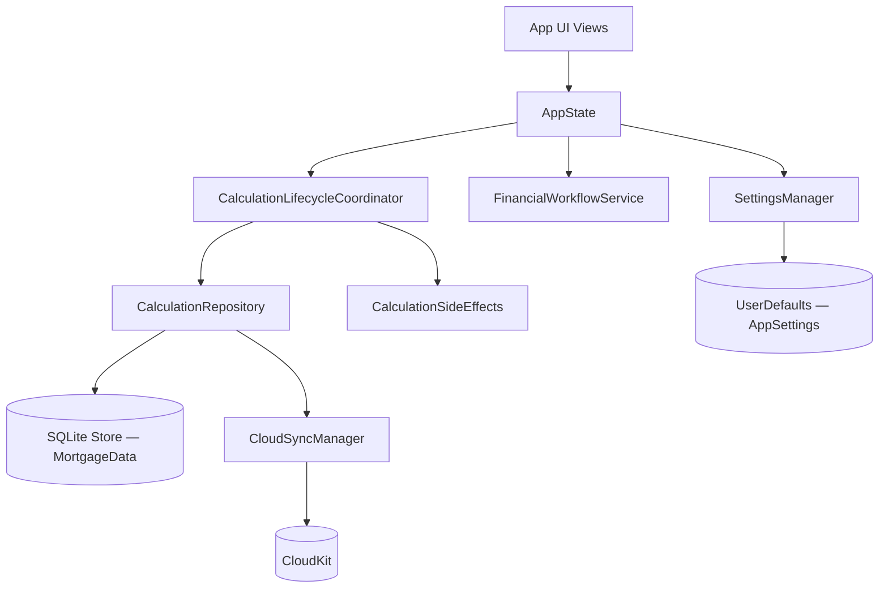

# Bricks Calc — Architecture

## System Overview

Bricks Calc uses a local-first architecture with centralized state management. All UI state flows through a single `AppState` object, which owns both persistence paths: user preferences via `UserDefaults` and document data via SwiftData.



---

The app separates fast settings access from durable calculation storage. `SettingsManager` persists `AppSettings` in `UserDefaults`, while saved calculation documents live in SwiftData and are surfaced through widgets, Spotlight, and CloudKit-backed sync.

Bricks Advisor is layered on top of this architecture rather than beside it. The AI chat flow gathers user intent and calls app-owned tools to calculate or save data, keeping the mortgage engine and save path inside the app.

## Major Layers and Modules

| Layer or module | Responsibility | Key files or types |
|---|---|---|
| App shell | App launch, scene setup, environment injection, deep-link routing | `BricksCalcApp`, `ContentView`, `AppDelegate` |
| App state | Owns current calculation, navigation state, and serves as the public workflow API | `Core/AppState.swift` |
| Workflow services | Orchestrates saving, updating, and recalculation workflows | `Core/FinancialWorkflowService.swift`, `Core/CalculationLifecycleCoordinator.swift` |
| Domain model and math | Represents mortgage data and performs calculations, schedule generation, validation-safe math | `Core/MortgageData.swift`, `Core/MortgageCalculator.swift`, `Core/DataValidator.swift` |
| Presentation layer | Centralizes UI-specific formatting logic for currency, terms, and breakdowns | `Core/Presentation/MortgagePresentation.swift`, `Core/Presentation/MortgageDisplayFormatter.swift` |
| Settings | Stores lightweight user preferences separately from document persistence | `Core/SettingsManager.swift`, `AppSettings` |
| Persistence & Side Effects | Owns SwiftData mechanics and synchronizes persistence events with system surfaces | `Core/CalculationRepository.swift`, `Core/CalculationSideEffects.swift` |
| Sync support | Tracks CloudKit-backed calculation sync status and exposes sync state for UI | `Core/CloudSyncManager.swift` |
| Discovery and extensions | Exposes calculations to Spotlight, widgets, and App Intents | `Core/SpotlightManager.swift`, `Core/WidgetDataProvider.swift`, `Intents/`, `Bricks Calc Widget/` |
| Premium and monetization | Tracks premium access and purchase flow | `Core/StoreKitManager.swift`, `Views/StoreView.swift` |
| AI guidance | Collects user inputs conversationally and calls app-owned tools | `Core/BricksCoachModel.swift`, `Core/Tools/CalculateMortgageTool.swift`, `Core/Tools/SaveCalculationTool.swift` |

## Core Models and Entities

- `MortgageData`: the main saved calculation document, including property values, insurance, expenses, prepayments, amortization caches, and metadata
- `AppSettings`: lightweight user preferences such as currency, language, default rates, analytics, and AI settings
- `PrepaymentData` and `ExpenseData`: user-defined adjustments that affect payoff strategy and real cost calculations
- `ChatMessage` and Bricks Advisor tool types: AI-facing conversation state around the same underlying mortgage engine

## State Ownership

- App-level state: `AppState.shared` owns `currentCalculation`, `savedCalculations`, navigation state, premium status, and write-path orchestration
- View-level state: views hold presentation and interaction state, but not persistence ownership
- Mutation path: user input updates `appState.currentCalculation` in memory first
- Save/update boundary: only explicit actions such as `saveCurrentCalculation()` and `updateCurrentCalculation()` persist to SwiftData

Write-path contract:

```text
update appState.currentCalculation (in-memory)
  -> SwiftUI reacts immediately
  -> explicit user action expresses intent to AppState
  -> AppState delegates to CalculationLifecycleCoordinator
  -> CalculationRepository saves to SwiftData
  -> CalculationSideEffects triggers WidgetCenter and Spotlight updates
```

## Persistence and Sync

- Storage model: saved calculations use SwiftData; settings use `UserDefaults` through `SettingsManager`
- Sync model: calculations sync through a CloudKit-backed shared SwiftData store path (`cloudKitDatabase: .automatic`). Settings remain device-local via `UserDefaults` and are not synced to iCloud.
- Shared-store setup: `WidgetDataProvider` prepares the App Group `Library/Application Support` directory before constructing the SwiftData `ModelContainer`, so iOS, macOS, and visionOS follow the same persistence policy instead of platform-specific store setup.
- Conflict handling: `AppState` reloads saved calculations on remote change notifications and refreshes the current calculation if it was updated elsewhere
- Failure behavior: the app remains functional locally even when sync is unavailable; the architecture is local-first, not cloud-dependent

## Integration Points

- WidgetKit and app group storage for calculation widgets
- Core Spotlight for indexing saved calculations
- App Intents and Siri Shortcuts for common actions
- StoreKit 2 for premium entitlements; visionOS purchases use SwiftUI's `PurchaseAction` path because `Product.purchase(options:)` is unavailable there.
- TipKit for guidance surfaces
- Firebase Analytics as optional analytics infrastructure on supported platforms; visionOS uses a no-op bootstrap path.
- Apple Foundation Models for Bricks Advisor on supported OS versions

## Constraints and Tradeoffs

- There is no autosave during active editing. This protects responsiveness but makes explicit save and update actions mandatory.
- `AppState` centralization simplifies write control and cross-feature coordination, but it also means architectural discipline matters to prevent it from becoming a dumping ground.
- The app supports AI guidance, but all finance results must still come from deterministic app code.
- Settings and calculations intentionally use different persistence mechanisms for performance and separation of concerns.

## Extension Guidance

- Preferred extension points: `AppState` for save-path orchestration, model types for new calculation data, tool types for AI actions, reusable components for shared UI
- Patterns to reuse: in-memory mutation first, explicit persistence, centralized validation-safe math, platform-adaptive view composition
- Anti-patterns to avoid: direct `modelContext.save()` from views, duplicate mortgage math outside the core engine, AI-generated financial outputs, duplicated settings state outside `SettingsManager`

## Performance and Reliability Notes

- `MortgageData` uses amortization caching to avoid rebuilding expensive schedules on every access.
- Cache invalidation is explicit when calculation inputs change.
- `DataValidator.safeDouble`, `safeDivide`, and related helpers are used to avoid `NaN`, `Infinity`, and divide-by-zero faults.
- Remote CloudKit changes are debounced before reloading app state to reduce sync-loop churn.

## Related Docs

- Overview: [../product/overview.md](../product/overview.md)
- Development guide: [dev-guide.md](./dev-guide.md)
- Testing strategy: [testing-strategy.md](./testing-strategy.md)
- Code reference: [code-reference.md](./code-reference.md)
- Cross-app patterns: [shared/engineering/codebase-principles.md](../../../shared/engineering/codebase-principles.md)
