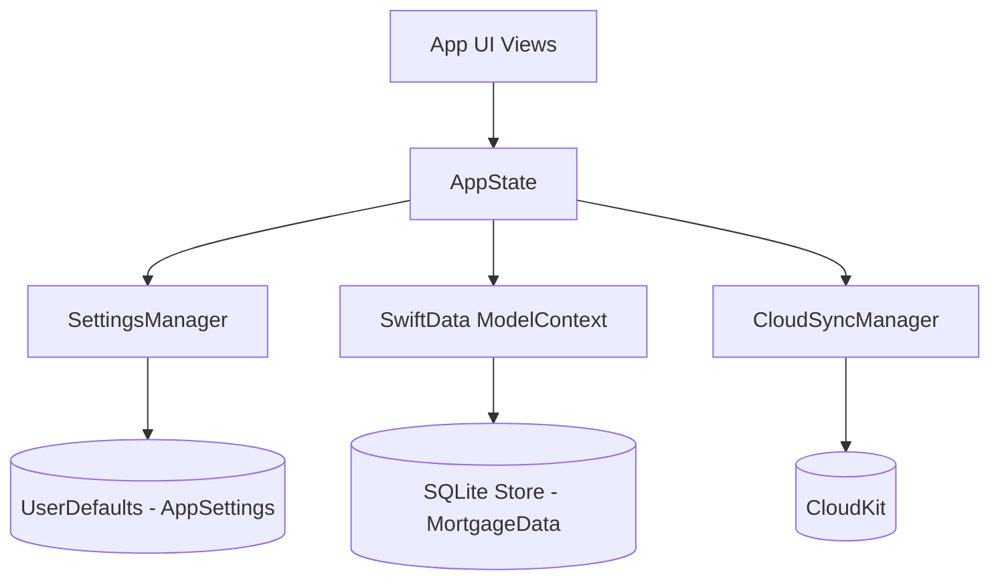

# Implementation Details & Architecture

**Category:** Explanation

This document chronicles the technical architecture, design decisions, and significant implementation phases of Bricks Calc. It serves as an explanation for understanding how the app's components interact and why certain patterns were chosen.

## Architecture Overview

Bricks Calc employs a local-first architecture with centralized state management, ensuring a highly responsive user experience while supporting robust data persistence and future cloud synchronization.

### Data Flow & Persistence

The core of the app's state is managed by a single source of truth: `AppState`.

#### Key Design Decisions:

1.  **Separation of Concerns:**
    *   **User Preferences (`AppSettings`):** Stored via `UserDefaults` (managed by `SettingsManager`). This provides synchronous, sub-millisecond access for UI preferences (e.g., currency, language, default interest rate).
    *   **User Documents (`MortgageData`):** Stored via `SwiftData` (managed by `AppState`). This provides robust SQLite storage for complex, relational data (calculations, prepayments, expenses) with ACID guarantees.
2.  **Centralized Save Management:**
    *   There is no autosave during user input. All `modelContext.save()` operations occur exclusively within explicit, user-initiated actions in `AppState.swift` (e.g., `saveCurrentCalculation()`, `updateCurrentCalculation()`).
    *   This prevents UI stutter during rapid slider or text field changes.
3.  **Local-First, Instant UI:**
    *   User inputs instantly update the in-memory `@Published var currentCalculation`.
    *   SwiftUI reacts immediately.
    *   Persistence and heavy calculations (like rebuilding amortization schedules) are deferred or debounced until explicitly triggered.
4.  **No Direct `@ModelContext` in Views:**
    *   Views interact with data solely through `@EnvironmentObject var appState`. Injecting `modelContext` directly into views is strictly avoided to prevent accidental saves and maintain architectural integrity.

## Performance Optimizations

### Amortization Cache

The generation of a full 360-month (30-year) amortization schedule is computationally expensive, especially when factoring in complex prepayments and monthly expenses.

*   **Caching Strategy:** `MortgageData` employs lazy caching for both its base and effective amortization schedules.
*   **Decoding:** To avoid recalculating schedules when loading saved calculations from SwiftData, the schedules are encoded to JSON `Data` before saving. Upon access, they are decoded once and cached in memory.
*   **Invalidation:** Caches are strictly invalidated whenever a parameter affecting the schedule (e.g., home price, interest rate, new prepayment) changes.
*   **Debouncing:** When users adjust prepayment sliders, the recalculation is debounced to prevent UI thread blocking.

### Settings Access Time

Refactoring `AppSettings` from a SwiftData `@Model` to a `UserDefaults` struct improved access times dramatically, shifting from ~50ms read/write to sub-millisecond execution.

## CloudKit Integration

Calculation sync is live. The shared `ModelContainer` is configured with `cloudKitDatabase: .automatic` in `WidgetDataProvider`, so saved calculations replicate through the user's iCloud account whenever available.

*   **Models:** `MortgageData`, `PrepaymentData`, and `ExpenseData` are SwiftData models compatible with the CloudKit schema. Legacy `CD__*Cache` fields remain in the production schema as deprecated residue; the current models treat cache properties as `@Transient`.
*   **Sync status:** `CloudSyncManager` (`Core/CloudSyncManager.swift`) is a `@MainActor` singleton that tracks sync state for UI surfaces. It persists the last confirmed sync date in the App Group `UserDefaults` suite. It does not sync settings.
*   **Settings:** `AppSettings` remain device-local via `UserDefaults`. Do not route settings through `NSUbiquitousKeyValueStore` or CloudKit unless the product decision changes.
*   **Local fallback:** When iCloud is unavailable, the app remains fully usable against the local SwiftData store.

## Best Practices Codified

1.  **Modify In-Memory First:** Always update `appState.currentCalculation` properties directly. Let SwiftUI handle the instant visual update.
2.  **Explicit Saves Only:** Call `appState.persistCurrentCalculation()` only in response to a definitive user action.
3.  **Use DataValidator:** For all floating-point math, especially involving user input or percentages, use `DataValidator.safeDouble`, `safeDivide`, etc., to prevent `NaN` or `Infinity` crashes.

## Related Docs

- Architecture: [architecture.md](./architecture.md)
- Development guide: [dev-guide.md](./dev-guide.md)
- Cross-app engineering patterns: [shared/engineering/codebase-principles.md](../../../shared/engineering/codebase-principles.md)
- Design system implementation: [shared/brand/design-system.md](../../../shared/brand/design-system.md)
